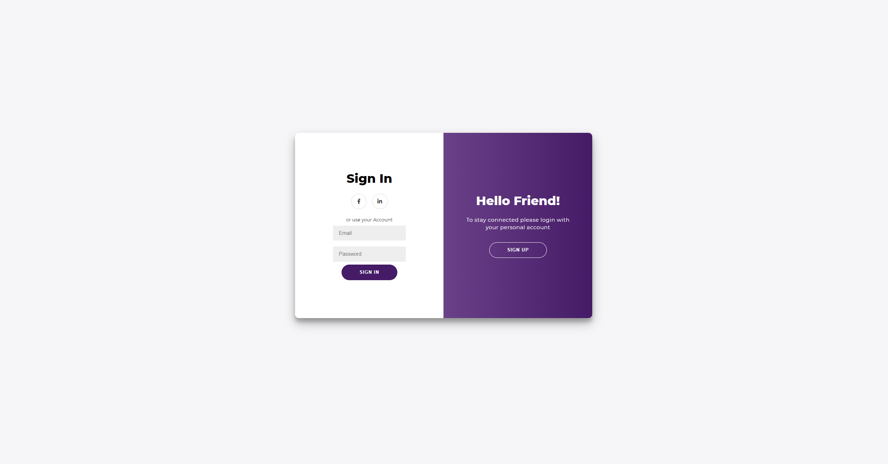
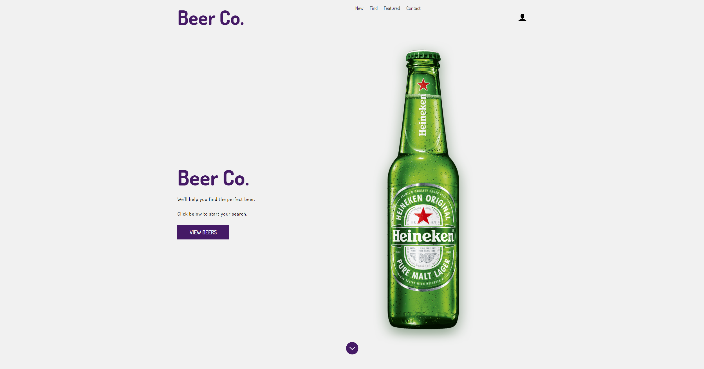
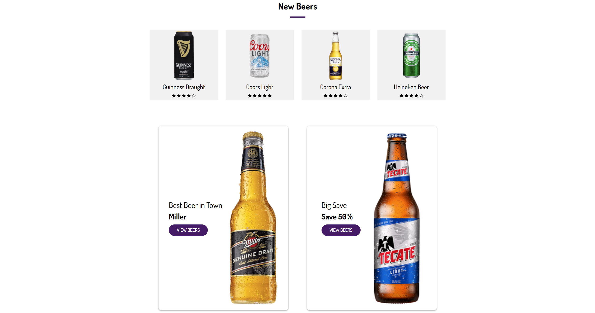
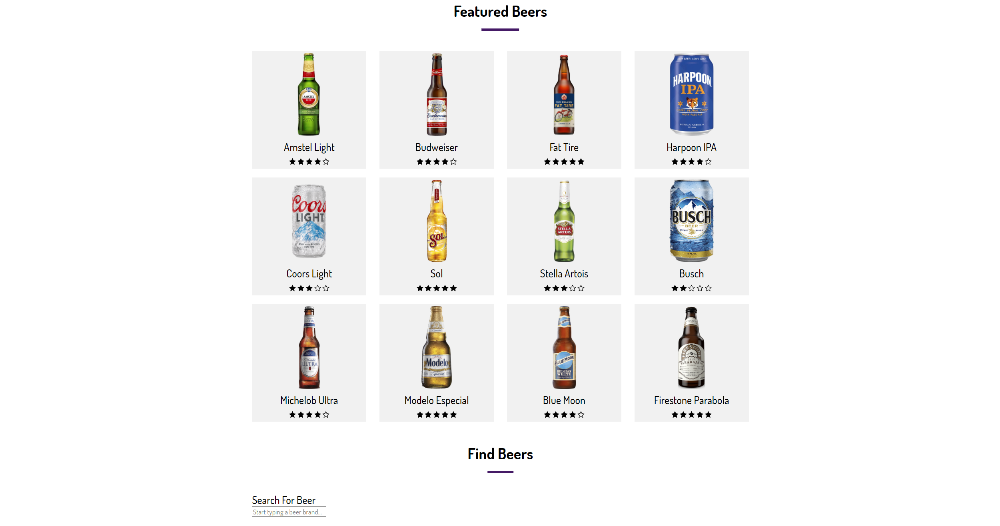
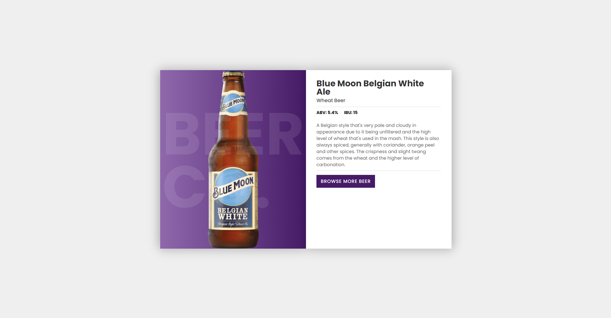

# BeerCo Beer Kiosk
_Final project submission for CS 423 - Software Engineering, at Rutgers University - Camden_

### Description
Our group was prompted with a hypothetical company and a general description of a piece of software that the business required.
Together, we defined requirements and specifications for the software. We then coordinated the work load across a developed timeline and delivered the final product, after 3 months of development.

The project was great because it was structured much like an industry software project would be. From building wireframes and drafting use cases, to scheduling progress
meetings with the _client_. This undertaking gave us practice with an array of components that are a part of developing software.

### Technologies Used
* HTML, CSS
* JavaScript, jQuery, AJAX
* PHP
* MySQL, phpMyAdmin

### Screenshots
The website is hosted on a localserver. So here are some screenshots to provide an idea of the website structure.

> Login Page
> 

> Home Page Header
> 

> Home Page Top Half
> 

> Home Page Bottom Half
> 

> Individual Product Page
> 
